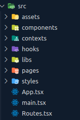

  
  <h1 align="center">Devio Challenge</h1>

 

## The Challenge 🔎
A restaurant needs to register its sales easily and quickly. It specializes in preparing fast food, and the current method using order slips slows down the entire process. The restaurant would like an intuitive environment that lists the most popular products and allows for their easy addition to the checkout. They also want a simple yet modern design.

 

## Planning 🧠

Given the challenge and the short execution time, I planned the tasks by first focusing on the visual aspects and then working on the logic behind everything. For this, I used the following tools:

* [Vite](https://vitejs.dev/) - A tool that brings React in the most streamlined way possible.
* [Tailwind](https://tailwindcss.com/) - A styling framework that allows for greater control and speed when styling the page.
* [React Router Dom](https://reactrouter.com/en/v6.3.0) - A library to dynamically manage page routing in your application.
* [Supabase](https://supabase.com/) - A tool that includes a database and other services, facilitating back-end optimization.

 

##### Project Architecture 🏗 :

 

  
    <ul>
      <li>./src -  Contains all project files</li>
      <li>./src/assets -  Contains all images, exported through a single file</li>
      <li>./src/components -  Contains all components</li>
      <li>./src/context -  Where the application's logic resides</li>
      <li>./src/libs -  Contains the configuration files for libraries (Supabase)</li>
      <li>./src/pages -  Contains the pages built using the components</li>
      <li>./src/styles -  Global styling configurations</li>
      <li>./src/Routes.tsx -  Configures the routes and contexts</li>
    </ul>

  
 
 

#### Hands-on 👷‍ : 
Given the proposed timeline and my inexperience with similar projects, I was able to implement the following functionalities:
 
* ✅ The user can view a small selection of products for quick selection.
* ✅ The user has the option to search for a product by name or code.
* ❌ The user will be able to add/remove items and monitor the order summary.
* ❌ The user will be able to view the total and the change.
* ✅ The user should be able to include the customer's name to deliver the order.
* ❌ Upon completing the order, it should be printed as a receipt for the customer (thermal printer), freeing the screen for the next order.
* ✅ The order should appear in the kitchen along with the customer's name.
* ✅ The kitchen can mark completed orders.
* ✅ Orders should appear in real-time in the kitchen.
* ✅ The user can include a note for the kitchen.
* ❌ The user can assign multiple payment methods when finalizing the order.
* ✅ Completed orders should appear on a screen with the customer's name and make a sound for pickup.

 

#### Feature Flow 🌀 :
Can select the quantity and view the total price >> 

    Can add a note >> Must click "Finalize Order" >> 
    
        Will be redirected to the payment page >> Must add their name >> 
        
            Order will be saved in a database >> Kitchen will receive the order in real-time >> 
            
                Kitchen can mark the order as completed (Visible on the "Pickup" page)

#### Observations 🧐 :

I understand that the project is not running perfectly, and there are several details I would like to add, such as allowing the user to place multiple orders, implementing an adequate payment system, and adding some type of feedback (like a toast notification) to help the user understand what's happening. Regardless, I’m satisfied with the delivery since my goal was to provide an MVP (Minimum Viable Product) to give the client an idea of the product and allow for necessary features to be added. After all, code that helps no one is just useless lines.

#### Challenges 😱 :

* **Implementing the Visual Design**: Initially, I struggled with implementing the proposed design, as the exact details (like fonts, colors, and sizes) were not provided. I tried to approximate as closely as possible based on comparisons.

* **Allowing Users to Place Multiple Orders**: I started working on this functionality but realized I was spending too much time on it. I decided to let users place only a single order but provide a complete journey for that order.

* **Saving Orders**: Another challenge was figuring out how to save the order information. Should I save it locally? I researched but couldn’t find a concrete solution. I considered creating a backend, but it would take too long, and I wouldn’t be able to deliver on time. I then tested platforms like Firebase and Back4App, but Supabase turned out to be the best fit with its super simple implementation.

#### Learnings 🤓 :

- **Managing User Data**: In previous projects, I often used a separate React "state" for each piece of user information. However, in this project, there were many manipulable pieces of information, and halfway through, I noticed I already had around 8 states and was losing track of my own code. I refactored to keep all the information in a single state, which inadvertently limited the user to placing just one order.

- **Saving Orders**: While finding a solution was challenging, the experience of testing various back-end services, struggling with implementation, and finally understanding and integrating Supabase taught me a lot about choosing and using the right tools.

 
 

## Expressions of Gratitude 🎁 

* I’m very grateful not only for completing the project but also for all the learning I gained along the way. 🤓
* Public thank you 💙
